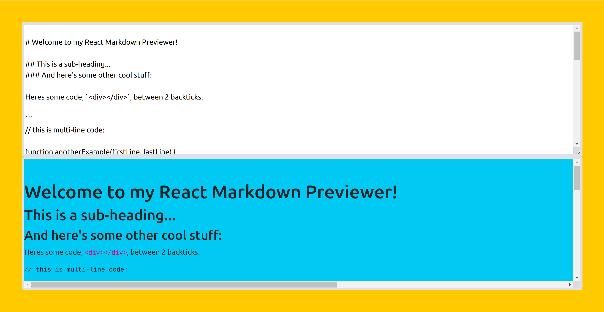

# Build a Markdown Previewer (Freecodecamp Project)

This is my solution for the Build a Markdown Previewer, it is built using React and Redux. This app is just a tool that reflects the github's markdown to its proper HTML.

## Live Preview

[Live Preview](https://javierbotero.github.io/mark-down-project/)

## Built With

- React ^18.2.0
- Redux
- Node v18.16.0

## Author

👤 **Javier Botero**

- Github: [@Javierbotero](https://github.com/javierbotero)
- Twitter: [@Javierbotero1](https://twitter.com/JavierBotero1)
- Linkedin: [Javier Botero](https://www.linkedin.com/in/javierboterodev/)

## 🤝 Contributing

Contributions, issues and feature requests are welcome!

## Show your support

Give a ⭐️ if you like this project!
